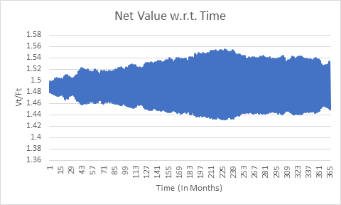
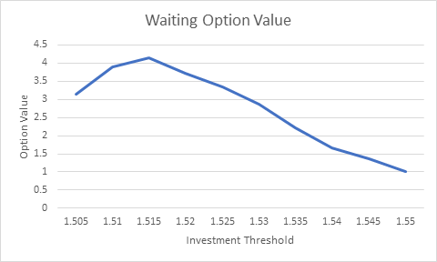

# Value-of-Wating-to-Invest-Option

## Introduction: 
- Robert McDonald and Daniel Siegel wrote a paper, published in 1986, that argues that the present value of an investment should consider not only the current PV of benefits and the PV of costs, but also the value of waiting to make the investment at a later date.  If making the investment is irreversible, but the decision to defer is reversible, this asymmetry creates value for companies deciding when to make investments.
- In this project we Implement this Idea to estimate the value of waiting to invest option. We assume that the expected cashflows and the costs follow mean reverting process and are positively correlated.

## Methodology: 
1.	Simulate the value of Expected monthly mean reverting cashflows.
2.	Simulate the correlated Expected costs cashflows.
3.	Set the investment threshold Q such that, when our value to costs ratio, i.e. Vt/Ft will be above that threshold, we will invest at that time.
So, present value of the payoff at that time will be,
Payoff = (Vt* - Ft*) e-rt* 
4.	Option Value will be, 
Option Value = Payoff – (V0 – F0)
5.	Find the optimal value of Investment threshold Q, over multiple simulations.

## Data:
	- Expected Cashflows (Vt) and Costs (Ft) follows the mean reverting process. Currently, expected value of cashflows is 600, with long run mean 625 with volatility of 30% monthly.-  Similarly, Value of costs is 400, with long run mean of 420, and volatility of 50% monthly. The mean reversion speed is 2 for both processes and have o.6 correlation. 
	- We are Simulating these cashflows and cost over next 365 months. 
	Data for case 78, can be seen in following graph.
	  

## Results:
After Simulating option price over various levels of thresholds, we get the following results.

As we can see from this graph, Value of waiting is maximum for threshold 1.515. i.e. for optimal investment we shall invest once the ratio of value to costs goes to 1.515.

## Conclusion:
From the above graph, we can see that while investing we shall look at current value and costs of investment as well as value of waiting  to make a optimal investment.
1.	We can use methodology in this simulations to find the value of waiting for mean reverting processes.
2.	Similar method can be used for Arithmetic Brownian Processes. Because they Grow linearly and Are discounted exponentially, there can be value in Waiting.
3.	For Geometric Brownian motion though, There are slim chances of usage of this method, since value is growing exponentially and also discounted exponentially. So if the Drift is greater than discounting rate, the value of waiting will be always growing with Time. Similarly, if discounted rates are greater, value of waiting will always be zero. 
